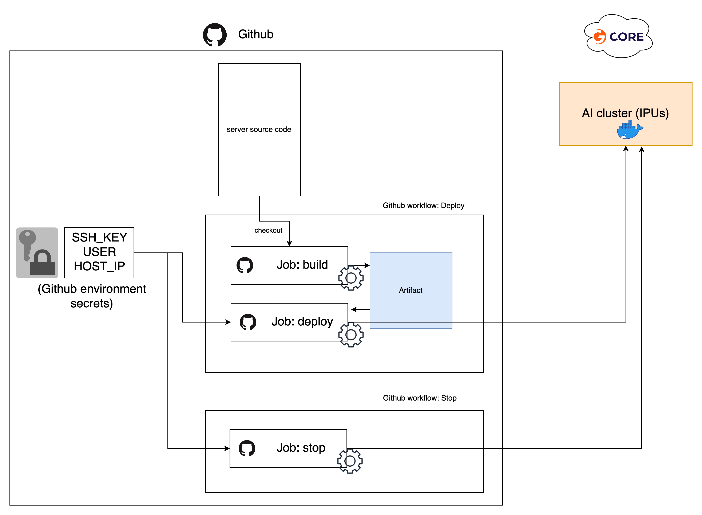

<!-- Copyright (c) 2022 Graphcore Ltd. All rights reserved. -->


# Simple deployment with FastAPI
FastAPI ASGI based model serving with GitHub workflow for deployment in a remote AI cluster.

- As an example, this server is running a stable diffusion inference API under `/stable_diffusion_2_txt2img_512`
API documentation generated by Swagger under the path operation `/docs`.
- The [Stable Diffusion 2 (Text to Image)](https://huggingface.co/stabilityai/stable-diffusion-2-1) model requires 8 IPUs.
- API documentation generated by Swagger under the path operation `/docs`.

# Summary
- [Deploy automatically from GitHub](#deploy-automatically-from-github)
- [Environment configuration](#configuration)
- [Models configuration](#model-configuration)
- [(debug) Launch the server from a VM](#run-the-server-from-a-vm-optional)
- [How to serve new models](#adding-a-new-model)

## Disclaimers:

-   This repository shows an example of how you might deploy a server with GitHub. We encourage you to build on this example to create a service that meets the security and resiliancy requirements of your application.
-   Using GitHub actions with secrets can bring security risks. It is important to review GitHub actions parameters and who can trigger them. Be careful of any modification brought to .github/ssh/action.yml, or any new action you introduce that uses GitHub secrets. For instance, secrets should never be logged or saved in an artifact file. Recommended read for good practises: https://engineering.salesforce.com/github-actions-security-best-practices-b8f9df5c75f5/
-   The [Graphcore PyTorch](https://hub.docker.com/r/graphcore/pytorch) base Docker image used in this example is subject to [Graphcore Container License Agreement](https://docs.graphcore.ai/projects/container-license/en/latest/).

## Deploy automatically from Github:
1) You need to set up a VM with IPUs in GCore and to open the port you wish to deploy the server on.
2) From GitHub, use the button "Use this template" to create a new repo from it.
3) Follow the [Configuration](#configuration) steps to set up the deployment environment.
4) Use the workflows to deploy:

In this repository, there are 2 simple GitHub workflows for deployment:
- `.github/workflows/deploy.yml`: (manually triggered) Build and deploy the artifact on the remote server - Sensitive information are configured via GitHub Secrets.
- `.github/workflows/stop.yml`: (manually triggered) Stop the container on the remote server.


To trigger these workflows, go under the repository `Action` tab to see workflows list on the left.
- Click on `Deploy`, then use the button `Run workflow`.
The server should take ~5 minutes before being ready.
You should now be able to access the server and check the API documentation at `http://HOST_IP:SERVER_PORT/docs`
- To stop the server, click on `Stop`, then use the button `Run workflow`.

## Configuration:
The deployment workflow is using an example GitHub environment named `GCore-deployment-demo`.
1) Configure a new GitHub environment named `GCore-deployment-demo` under the repository `Settings` (or modify the workflow files according to your environment name).
2) The deployment scripts require SSH access to the VM, it is recommended to generate a new set of keys just for this purpose and to authorise it on your VM.
(To authorize a new SSH key on GCore VM, add the public key to `~/.ssh/authorized_keys`)
3) Add 3 GitHub encrypted secrets: `SSH_KEY`, `USER` and `HOST_IP` at the environment level or at the repository level.

- The encrypted secrets must contain the following:
    - `SSH_KEY`: content of the private key
    - `USER`: Gcore VM username
    - `HOST_IP`: Gcore VM IP address

4) The server should be configured via the .env file at the root of this repository. It contains:

    - `COMPOSE_PROJECT_NAME`:  Name of the container
    - `SERVER_PORT`: Port where your server will be accessible
    - `SERVER_NUM_WORKERS`: Number of Uvicorn workers
    - `SERVER_MODELS`: List and configuration of models to run (see [Model Configuration](#model-configuration) section)
    - `SERVER_WAIT_TIMEOUT`: Timeout for server start (in seconds)
    - `POPTORCH_LOG_LEVEL`: Log level for the underlying Graphcore's Poptorch framework (ERR, INFO, DEBUG)

## Model configuration
Syntax of SERVER_MODELS environmental variable:
```
SERVER_MODELS='[
    ...
    {
        "model":"name of the directory where model is stored",
        "replicas":"number of replicas to run"
    },
    {
        "model":"name of the directory where model is stored"
    },
    ...
]'
```
Note that:
 - variable value has to be single quoted
 - `replicas` setting defaults to 1 replica if not set
 - although the example has new lines for clarity it is advised to keep value of `SERVER_MODELS` without whitespaces, most means of passing environmental variable with spaces will not work

## Run the server from a VM (optional):
When debugging, you may want to skip the deployment workflow and just run the server manually from your VM.
You can use the following steps:

1) After logging to your VM, clone the repo:
- `$ git clone https://github.com/graphcore/api-deployment`
- `$ cd api-deployment`
2) Run the deployment script, this will handle the container setup and run it:
- `$ .github/scripts/run_server_docker_start.sh`
3) To stop you can use:
- `$ .github/scripts/run_server_docker_stop.sh`

To serve a new model, the main steps are the following:

### 1. Add the model files to the repo
Add a Python folder `<new_model>/` in `src/models/` which will containn your model, the model pipeline, endpoint and any other required files. It instantiates a callable named `pipe` that takes the necessary input data (we can directly import Graphcore-Optimum `Pipeline` for instance).

In this example we consider `inputs` to be a Dict (you are free to change it).
You should also define a function `compile`: The input is your object `pipe` and the execution of this function should trigger the IPU compilation.

ex: `<new_model>/pipeline.py`

```python
class Pipeline:
    def __init__(self, args):
        # Various parameters initialisation

    def __call__(self, inputs: Dict) -> Dict:
        # pre-processing,
        # model call,
        # etc ..
        prediction_dict = ...
        return prediction_dict

def compile(pipe: Pipeline):
    # compilation logic goes here, for instance:
    # pipe(dummy_inputs)
    # ...
    return
...
pipe = Pipeline(args)
```
By implementing this interface, your new model will now be available as `<new_model>` (your file name) as a new IPUWorker.

### 2. Create the endpoint file
Create the endpoint for this new model. In `<new_model>/endpoint.py`:

```python
@router.post("/new_model", response_model=NMResponse, include_in_schema = "new_model" in models)
def run_nm(model_input: NM):
    data_dict = model_input.dict()
    w.workers["new_model"].feed(data_dict)
    result = w.workers["new_model"].get_result()
    return {
        "results": result["prediction"]
    }
```
In this simple example, our path operation is `/new_model`. We create the function `run_nm()` and use FastAPI decorator
`@router.post()` to make it receive POST requests, this connects to the central FastAPI application in `src/server.py`. Using `include_in_schema` boolean parameter will enable or disable this path given the list of model we configure.

Now, we can see we have 2 types describing our input and outputs: `NM` and `NMResponse`. These should be defined in the endpoint file `<new_model>/endpoint.py`. These use Pydantic `BaseModel` and will be used to automatically to match the `json` fields from the HTTP request and response. For instance:

```python
class NM(BaseModel):
    input_1: str
    input_2: str

class NMResponse(BaseModel):
    results: str
```
In this example, `NM` contains two fields, it can automatically be converted to `Dict` when calling `model_input.dict()`.

These are the 2 most important lines:
```python
w.workers["new_model"].feed(data_dict)
result = w.workers["new_model"].get_result()
```
The first one will select our "new_model" `IPUWorker` from the `IPUWorkerGroup` and feed the data dict to its input queue.
The second one will retrieve the results from the `IPUWorker` output queue.

Finally , return the results as a Dict to match `NMResponse` format.
Here we supposed our model prediction is available under the dict key `result["prediction"]`.

### 3. Edit your config.

By default the server is not configured yet to run your model.
To add it you can either: modify the default config in `src/config.py` and add it to `models` list.
Or temporary, modify the `.env` file variable `SERVER_MODELS` (or just set the environment variable `SERVER_MODELS`) to add your model name "new_model" to the list. (You should make sure you have enough IPUs available to run all the models in the list).

You can also modify the `.env` environment variable `SERVER_MODELS` at the deployment container runtime, if you wish to only run some of the deployed models.

### 4. Run the server
**Note: You can skip this step for the existing demo, as the fully-baked image is already publicly available on Graphcore's DockerHub and is in the deployment config.**

To run the server, build the docker image from the root repository folder:
```
    - docker build -t <deployment_name> .
```
Next, run the image. Ensure env variables `IPUOF_VIPU_API_HOST` and `IPUOF_VIPU_API_PARTITION_ID` are set on the host machine. Wait until the server boots up (all binaries have to be downloaded and graphs compiled):
```
docker run \
    -v $(pwd)/src:/src \
    -e POPTORCH_CACHE_DIR=/src/model_cache \
    -e HUGGINGFACE_HUB_CACHE=/src/model_cache/ \
    -e HF_HOME=/src/model_cache/ \
    --env-file <(env | grep IPU) \
    --network host \
    --device=/dev/infiniband/ \
    --cap-add=IPC_LOCK \
    <deployment-name>
```

Now if you run the server and go to the `IP_ADDRESS:PORT/docs` url, you should be able to see and test your new API !

(Optional) Next, stop the docker image. It has now been run and model executables and binaries have been generated. Run the build step again:
```
docker build -t <deployment_name> .
```
to bake the executables and binaries into the Docker image, so the models do not have to be recompiled when deploying.

Verify the image exists in the local image registry:
```
docker image list | grep custom-image-name
```

Then to upload the image to a custom container registry:
```
docker login
```
To store the image on DockerHub, the image path must start with your account name:
```
docker tag <deployment_name>:latest <dockerhub-username>/<dockerhub-deployment-name>:<optional-dockerhub-tag>
```
Then you can push the image to DockerHub:
```
docker push <dockerhub-username>/<dockerhub-deployment-name>:<optional-dockerhub-tag>
```


## Testing the deployment:
The included notebook: `running_local_endpoint.ipynb` outlines a simple example of requesting and generating images using the deployed Stable Diffusion model. Simply add the URL for your deployment in the first cell to enable it.
